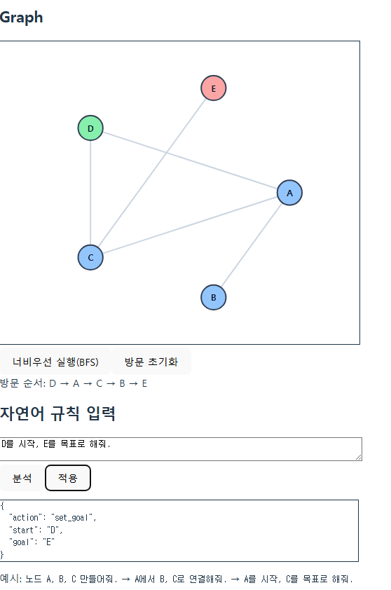

# 개발 일지

## 프로젝트 개요
- **프로젝트명**: 바이브 플레이그라운드
- **목표**: Gemini CLI를 활용한 서버 없는 샌드박스형 문제 제작, 공유, 풀이 웹 애플리케이션 개발
- **개발 기간**: 2025.10.20 ~ 2025.10.27

---

## 개발 과정
- **기록 방법**:
    1. 작업은 일 단위로 나누어 기록
    2. PRD 마스터 프롬프트 제외 일일 1회 ChatGPT + Gemini로 페르소나 프롬프트 작성
    3. 작성한 MVP로 Gemini CLI 대화 시작, "/chat save 태그이름" 명령어로 저장 
    4. 저장한 내용을 "/chat share 파일이름" 명령어로 마크다운 파일로 내보내 현 문서와 연결
    5. 이외에는 수작업으로 작성한 뒤 일관된 마크다운 문법을 위해 Gemini 사용

### Day 1 - 환경 세팅 및 codec 모듈 구현

#### GEMINI CLI 사용 프롬프트

- **역할**: Day 1 페어 프로그래밍 어시스턴트.
- **목표**: '서버 없는 샌드박스형 문제 제작·공유·풀이 웹앱'의 1일차 개발 수행.
- **작업 단계**:
    1. Vite + React + TypeScript + Tailwind 초기 세팅 명령어 제시.
    2. `src/`, `public/`, `tests/` 기본 폴더 생성 스크립트.
    3. `App.tsx`, `main.tsx`, `routes.tsx`의 기본 스텁 생성.
    4. `codec/shareCode.ts` 구현 (Base64url + LZ 압축 + CRC32 검증)
    5. `tests/codec.test.ts` 작성 (encode/decode roundtrip 테스트)
    6. `README.md`에 ‘Day 1 완료’ 상태 요약 추가.
- **출력 형식**:
    1. 각 파일의 상대경로와 코드 전문
    2. 실행 명령어 (pnpm 기준)
    3. 커밋 메시지 제안 (Conventional Commit 1~2줄)
    4. AI 관여 표시: `[ai-assist]`

[Day 1 Gemini 전체 대화 로그 보기](./gemini_cli_logs/Day1-Log.md)

#### 프롬프트 적용 결과
- 스펙에 명시된 초기 개발 환경 구축
- 기본 스텁 생성 및 홈페이지 텍스트 출력
- 문제 데이터 인코딩 및 디코딩을 위한 `shareCode` 모듈 구현 (서버 대체용 공유 코드 생성기)
- `shareCode` 모듈의 왕복, 무결성, 형식 검증 테스트 완료

#### 문제 및 해결 과정
1.  **MCP를 이용한 github 연동 과정에서 Gemini CLI 접근 권한 문제 발생**
    -   토큰 생성 후 `.gemini/settings.json`에 명시하여 해결
2.  **푸시 과정에서 보안 문제 발생**
    -   보안에 민감한 토큰이 포함된 `.gemini/settings.json`에 대해 `.gitignore` 업데이트 및 추적 제거
3.  **추적 제거 후에도 이전 커밋에 포함된 토큰으로 인한 푸시 보안 문제 해결 실패**
    -   수동으로 깃 저장소 초기화 후 재커밋 요청

#### 학습 내용
- 프롬프트를 큰 틀과 작은 틀로 분할하여 접근하는 기법 활용 및 효율성을 확인.
- MCP는 LLM이 외부와의 표준 통신을 돕는 서버일 뿐, 권한과 보안 측면에서 위험성이 존재하다는 점을 이해.
- Gemini CLI로 생성된 인코딩과 디코딩 함수를 분석하여 직렬화, 압축, 복원 과정의 중요성 학습.

---

### Day 2 - 환경 세팅 및 codec 모듈 구현

#### GEMINI CLI 사용 프롬프트

- **역할**: Day 2 페어 프로그래밍 어시스턴트.  
- **목표**: ‘서버 없는 샌드박스형 문제 제작·공유·풀이 웹앱’의 **엔진(Core)** & **DSL(Runtime)** 2일차 개발 수행.  

- **작업 단계**:  
    1. `src/core/engine.ts` 생성 — 결정론적 RNG(mulberry32) + tick 기반 `Engine` 클래스 스텁  
        - **API**: `constructor(seed?: number)`, `update(dt:number)`, `pause()`, `resume()`, `reset()`, `getState()`  
        - **기능**: running일 때만 time 누적, seed 변경 시 RNG 재생성 가능 구조  
        - **커밋**: `feat(core): add deterministic RNG and Engine skeleton [ai-assist]`  

    2. `tests/engine.test.ts` 작성 — RNG 일관성 & tick 누적 동작 1차 검증  
        - 동일 seed 재현성, update 누적, pause/resume, reset 기본 시나리오  
        - **커밋**: `test(core): add engine RNG and tick behavior tests [ai-assist]`  

    3. `src/core/dsl.ts` 생성 — 최소한의 규칙 실행기(조건/액션) 스펙 정의  
        - **타입**:  
          ```ts
          export interface Rule {  
            event: string;  
            condition?: (state:any)=>boolean;  
            action:(state:any, params?:any)=>void;  
            params?:Record<string,any>;  
          }  
          export function runRule(rule: Rule, state: any): any  
          ```  
        - condition 없거나 true → action(state, params) 실행 후 state 반환  
        - **커밋**: `feat(core): implement minimal DSL Rule and runRule [ai-assist]`  

    4. `tests/dsl.test.ts` 작성 — DSL 규칙 실행 검증  
        - 조건 없음 / 불일치 / 일치, state 변경 반영, params 전달  
        - **커밋**: `test(core): cover DSL rule execution and condition filtering [ai-assist]`  

    5. 엔진×DSL 통합 지점 스텁(확장 포인트만)  
        - `src/core/index.ts`에 재노출(`export * from './engine'; export * from './dsl';`)  
        - `src/challenge/schema.ts` 스텁(향후 JSON 룰 매핑용 인터페이스 초안만)  
        - **커밋**: `chore(core): re-export core modules and add challenge schema stub [ai-assist]`  

    6. 문서 업데이트  
        - `GEMINI.md`에 "Day2 엔진/DSL 협업 프롬프트 패턴" 추가(프롬프트 요약, 생성물, 테스트 방법)  
        - `README.md`에 "엔진·DSL 모듈 초안 완성(테스트 통과)" 한 줄 추가  
        - **커밋**: `docs: update GEMINI.md and README for Day2 engine/DSL scope [ai-assist]`  

- **실행 명령어 (pnpm 기준)**:  
    - 테스트 실행: `pnpm test` (또는 `pnpm vitest run --coverage`)  
    - 타입 체크: `pnpm tsc -p .`  
    - 포맷/린트(있다면): `pnpm lint && pnpm format`  

- **출력 형식**:  
    1. 각 파일의 상대경로와 코드 전문  
        - `src/core/engine.ts`  
        - `tests/engine.test.ts`  
        - `src/core/dsl.ts`  
        - `tests/dsl.test.ts`  
        - `src/core/index.ts`  
        - `src/challenge/schema.ts` (스텁)  
        - `GEMINI.md` 변경 diff 또는 섹션 전문  
        - `README.md` 변경 diff 또는 문장 추가  
    2. 실행/검증 명령어 (위 pnpm 명령 포함)  
    3. 커밋 메시지 제안 (Conventional Commit 1~2줄, 단계별 1커밋)  
    4. AI 관여 표시: `[ai-assist]`  

- **검증 기준(자동/수동 혼합 체크를 염두)**:  
    - 동일 seed에서 RNG 시퀀스 동일  
    - `Engine.update(dt)`가 running=true일 때만 time 누적  
    - pause/resume/reset 시나리오가 테스트 통과  
    - DSL: condition 미지정/true 시 action 수행, false 시 skip, state 반영 확인  
    - Day2 결과가 `README.md`/`GEMINI.md`에 반영됨  

- **비고(스케줄 가드)**:  
    - Day3에서 "JSON DSL 스키마 ↔ Rule 바인딩 + UI(빌더/플레이어) 이벤트 훅"으로 확장 예정이므로, Day2에서는 **엔진/DSL 최소 기능 완성과 테스트 통과**에 집중.  
    - 불필요한 옵티마이즈/리팩토링은 Day4로 이월.  

[Day 2 Gemini 전체 대화 로그 보기](./gemini_cli_logs/Day2-Log.md)

#### 프롬프트 적용 결과
- 결정론적 RNG(mulberry32)와 tick 기반 `Engine` 추가 (`src/core/engine.ts`)
- 최소 규칙 실행용 DSL 러너 초안 구현 (`src/core/dsl.ts`)
- 코어 재노출 및 챌린지 스키마 스텁 추가 (`src/core/index.ts`, `src/challenge/schema.ts`)
- 엔진/DSL 동작 검증 테스트 작성 및 통과 (`tests/engine.test.ts`, `tests/dsl.test.ts`)

#### 문제 및 해결 과정
1.  **엔진의 시간 갱신 `update(dt)` 엣지 케이스 발견 및 수정**
    - AI 초안: `running`일 때 `time += dt` (검증/가드 부재)
    - 수정: `Number.isFinite(dt)`가 아니거나 `dt < 0`이면 갱신 중단 처리 추가
    - 테스트 보강: `-1.0`과 `0.0` 입력에서 시간이 증가하지 않는지 확인
    - 근거: 결정론적 시뮬레이션에서 음수·무한 `dt` 허용 시 시간 역행/NaN 전파로 상태 오염 위험

2.  **DSL 설계의 타입 안정성 강화**
    - AI 초안: 상태/파라미터에 범용 타입 any 사용 제안
    - 수정: `Rule<TState, TParams>` 제네릭으로 상태/파라미터를 강타입화, `action(state, params)` 시그니처 고정
    - 테스트 보강: 
      - 조건 없음/불일치/일치 분기별 액션 호출 검증
      - `params` 전달 및 상태 변경 반영 확인
    - 효과: 규칙 작성 시 IDE 인텔리센스와 타입 오류 조기 발견
    - 근거: any는 타입 오류가 컴파일 과정을 통과하고 런타임 에러의 원인이 되므로 지양해야 함

3.  **스텁 테스트 파일 내 unknown 타입 추론 오류**
    - 문제 해결 방법: Gemini CLI의 빌트인 MCP인 files를 이용해 `@파일 이름` 형식으로 수정 요청
    - 원인: 제네릭으로 변경된 Rule 타입에 기본값인 unknown이 특정 파라미터의 타입 추론에 영향
    - 수정: 함께 사용할 state 타입을 제네릭으로 명시

#### 학습 내용
- any 타입을 남용하는 예시처럼 AI는 당장의 구현 목표 달성에만 특화되어 있으므로 검토 필수.
- 엔진과 DSL을 스텁 형태로 구분하면 잦은 정책 변경에도 엔진의 안정성을 확보하며 독립적인 개발이 가능.
- files:// MCP를 이용해 @로 파일에 접근하면 명시적 컨텍스트로 인식해 정확도 상승.

### Day 3 - 프로젝트 방향 재정립 및 시각화

#### GEMINI CLI 사용 프롬프트(1차 시도 실패로 인한 2차 프롬프트)

프로젝트 방향을 다시 재정립할게. Day3 프롬프트를 아래와 같이 리셋해줘.

# 역할
너는 “Vibe Playground” 프로젝트의 AI 협업 파트너로,  
현재 Day1~2까지의 개발 결과를 기반으로  
프로젝트 방향을 **그래프 기반 퍼즐 샌드박스**로 재정립한다.  

이제부터 이 프로젝트는 **물리 시뮬레이션이 아닌, AI 기반 그래프 퍼즐 제작·공유·풀이 웹앱**으로 발전하며,  
GEMINI.md와 README.md를 그에 맞게 갱신해야 한다.

---

## 🎯 프로젝트 개요 (갱신 목표)

### 프로젝트명
**Vibe Playground: Graph Puzzle Sandbox**

### 핵심 목표
1. **서버 없는 환경**
   - 모든 데이터는 LocalStorage + Base64 해시를 통해 처리
   - 서버, DB, 백엔드 전혀 사용하지 않음
2. **AI 협업**
   - Gemini CLI가 자연어를 구조화된 Graph DSL(JSON)으로 변환
   - 예: “A에서 B로 연결해줘.” → `{ "action":"add_edge","from":"A","to":"B" }`
3. **문제 제작과 공유**
   - 사용자는 자연어로 그래프를 생성하고 목표(start/goal)를 설정  
   - 결과를 직렬화·압축해 **도전 코드(Challenge Code)** 로 공유 가능
4. **문제 풀이와 검증**
   - 다른 사용자가 공유 코드를 입력하면 그래프 복원  
   - 자연어로 탐색 규칙 제시(BFS/DFS 등)  
   - Gemini가 이를 JSON Rule로 변환 후 시뮬레이션 실행  
   - 성공 시 **Proof Code** 자동 생성 및 공유 가능

---

## ⚙️ 기술 구조 (Day3 기준)

### A. Core Layer
- `src/core/engine.ts` → tick 기반 결정론적 시뮬레이터  
- `src/core/dsl.ts` → 이벤트/액션 기반 Rule 실행기  

### B. Graph Layer
- `src/graph/model.ts` → Node, Edge, Graph 구조 정의  
- `src/graph/engine.ts` → 탐색 루프(visit, discover, queue/stack)  
- `src/graph/actions.ts` → markColor, enqueue, visitNext 등 동작 정의  
- `src/graph/rules.ts` → BFS/DFS Rule 템플릿

### C. AI & NLU Layer
- `src/nlu/mapper.ko.ts` → 제한된 한국어(CNL) → Rule JSON 변환  
- `src/schemas/graph-rule.schema.json` → Ajv 스키마 검증  
- `src/codec/shareCode.ts` → LZ + Base64url + CRC32 직렬화/복원  

### D. UI Layer
- `src/ui/BuildMode.tsx` → 그래프 제작 모드 (노드/간선 추가, 목표 설정)  
- `src/ui/PlayMode.tsx` → 도전 모드 (규칙 입력, 시뮬레이션 실행)  
- `src/ui/GraphCanvas.tsx` → 그래프 시각화 및 탐색 상태 표시  
- `src/ui/RuleEditor.tsx` → 자연어 규칙 입력 및 Rule 미리보기  

---

## 💬 자연어 → DSL 변환 예시 (한국어 CNL)

| 사용자 입력 | Gemini 해석 결과 |
|--------------|------------------|
| “노드 A, B, C를 만들어줘.” | `{"action":"add_nodes","nodes":["A","B","C"]}` |
| “A에서 B, C로 연결해줘.” | `{"action":"add_edges","edges":[["A","B"],["A","C"]]}` |
| “A를 시작, F를 목표로 해줘.” | `{"action":"set_goal","start":"A","goal":"F"}` |
| “너비 우선 탐색으로 실행해.” | BFS 규칙 JSON 템플릿 |
| “결과를 공유 코드로 만들어줘.” | `{"action":"export_challenge"}` |

---

## 🎮 시나리오 예시 (사용자 체험 흐름)

### 🧩 1️⃣ 문제 제작자 모드
1. 사용자가 입력:  
   > “노드 A, B, C, D 만들어줘.”  
   > “A에서 B, C로 연결하고, B는 D로 이어줘.”  
   > “A를 시작, D를 목표로 해줘.”
2. Gemini CLI 해석 결과:  
   - Graph JSON 생성  
   - `v1_Graph_A2dDkWc==` 공유 코드 생성
3. 사용자는 이 코드를 친구에게 전달

---

### 🧩 2️⃣ 도전자 모드
1. 친구가 “도전 코드”를 입력 → 문제 로드  
2. 동일 그래프 렌더링  
3. 자연어로 탐색 규칙 입력:
   > “방문한 노드는 초록색으로 표시해.”  
   > “아직 방문하지 않은 노드는 큐에 추가해.”  
   > “큐가 빌 때까지 다음 노드 방문을 반복해.”
4. Gemini CLI 변환 결과:
   ```json
   [
     {"event":"visit","action":"markColor","params":{"color":"green"}},
     {"event":"discover","condition":"!visited(neighbor)","action":"enqueue"},
     {"event":"tick","condition":"!queue.empty","action":"visitNext"}
   ]
   ```
5. 시뮬레이션 실행 → A→B→C→D 탐색 후 목표 도달  
   - “Goal Reached in 4 steps!” 표시  
   - Proof Code 자동 생성 → `proof_v1_BFS_4steps_Z19Q==`

---

## 🧠 AI 협업 구조

| 단계 | AI 역할 | 설명 |
|------|----------|------|
| 1 | 자연어 → DSL(JSON) | 명령 의도 분석, 그래프 구조 변환 |
| 2 | Rule 템플릿 추천 | BFS, DFS 규칙 자동 생성 |
| 3 | JSON 검증 | Ajv 스키마로 Rule 유효성 검사 |
| 4 | 직렬화 | LZ + Base64url + CRC32 |
| 5 | 복원 | Challenge Code → JSON 복원 후 실행 |

---

## 🧩 교수님 평가 대비 요약

| 항목 | 설명 |
|------|------|
| **창의성** | 사용자가 언어로 그래프를 직접 설계하고 퍼즐을 만든다 |
| **실용성** | 탐색 알고리즘·조건·반복 구조를 시각적으로 체험 가능 |
| **기술적 도전성** | AI 변환기 + DSL + 직렬화/복원 시스템 구축 |
| **AI 협업성** | 자연어 → 구조화 → 실행의 완전 자동화 루프 |

---

## 📑 문서 갱신 요청

Gemini CLI는 아래 두 문서를 자동 재작성해야 한다:

1. **GEMINI.md**
   - 프로젝트 목적, AI 협업 구조, CNL → Rule 변환 흐름, 예시 포함
   - “그래프 퍼즐 샌드박스” 중심으로 작성
   - 자연어 입력/해시 공유/리플레이 개념 포함

2. **README.md**
   - 전체 개요, 주요 기능, 실행 방법, 사용 예시, 기술 스택 명시
   - “서버 없는 AI 그래프 퍼즐 샌드박스” 문구 포함

---

## 🧾 출력 요구
- 수정된 **GEMINI.md** 와 **README.md** 전체 출력
- Markdown 형식 유지
- 각 문서 상단에 `[ai-assist] auto-update` 표기
- 문서 내 날짜는 `2025-10-22`로 갱신

---
[Day 3 Gemini 전체 대화 로그 보기](./gemini_cli_logs/Day3-Log.md)
[Day 3 Codex 전체 대화 로그 보기](./codex_logs/Day3-Log-Codex.md)

#### 프롬프트 적용 결과
- MVP 철학에 따른 최소한의 기능 구현에 집중하여 프로젝트 방향을 재정립하는 데 성공
- 주제를 변경하면서 발생한 미사용 코드 자동 삭제  
- 웹 내 입력 창에서 제한된 텍스트 패턴을 감지해 그래프 생성 및 탐색하는 1차 목표 구현



#### 문제 및 해결 과정
1.  **초회 프롬프트를 이용한 물리 퍼즐 제작 실패**
    -   Gemini CLI와 Codex를 함께 사용하여 물리 엔진 구현을 시도했으나 실패
    -   개발 기간을 고려해 실현 가능한 주제로 프로젝트 재정립

2.  **Gemini CLI의 반복적인 동일 오류 해결 실패**
    -   Gemini CLI와 Codex를 병행하는 에이전트 오케스트레이션 기법 선택
    -   Gemini CLI는 프로젝트 전체 설계 및 스크립트 작성, 단일 버그 수정 할당
    -   Codex는 코드 분석, 복합 버그 수정, 리팩토링 할당
    -   둘의 결과를 종합하여 핵심 문제 발견, 오류 해결 성공

3.  **원격 저장소와 로컬 Git 계정 불일치 문제**
    -   GitHub 원격 저장소에 푸시된 커밋의 작성자가 의도하지 않은 서브 계정임을 확인
    -   VS Code 연동 계정과 로컬 컴퓨터의 Git 전역 설정에 등록된 계정이 다른 것이 원인
    -   본계정 정보로 올바르게 재설정한 뒤 테스트용 커밋 푸시를 통해 해결

#### 학습 내용
- Gemini CLI와 Codex를 함께 사용해 상황 별로 적절한 도구를 호출하는 에이전트 기법 사용.
- LLM을 대체하기 위해 제한된 CNL -> 정규식/토큰 매핑 -> json -> ajv 파이프라인 분석.
- 웹 어플리케이션 개발 과정에서 브라우저 콘솔을 이용한 디버깅의 중요성을 확인. 