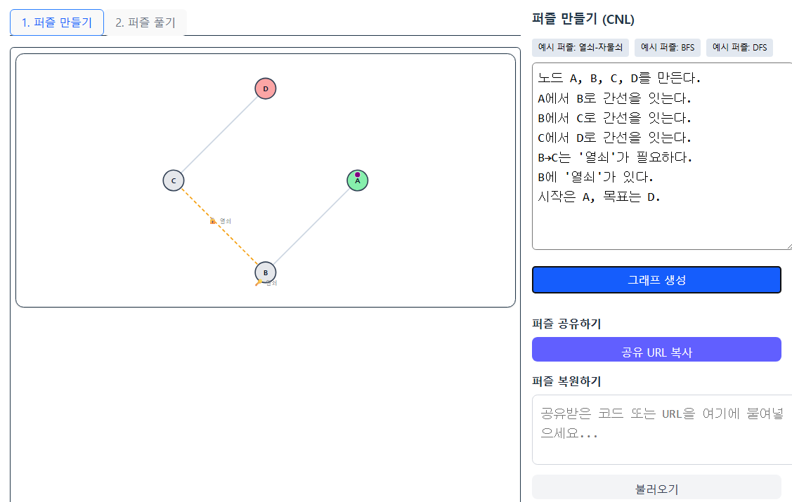
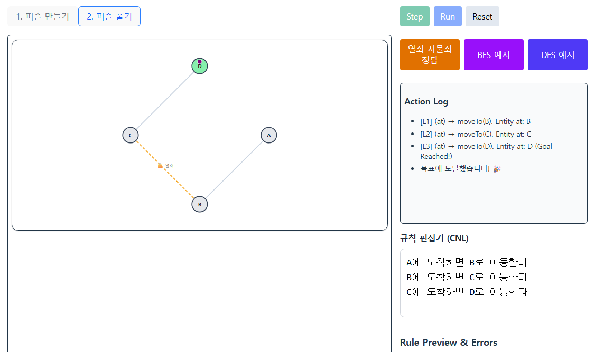

[ai-assist] auto-update
# Vibe Playground: Graph Puzzle Sandbox

**최종 업데이트: 2025-10-25**

[](https://react.dev/)
[](https://www.typescriptlang.org/)
[](https://vitejs.dev/)
[](https://tailwindcss.com/)

**서버 없는 AI 기반 그래프 퍼즐 샌드박스**
<br>
A serverless, AI-powered web application for creating, sharing, and solving graph-based puzzles using natural language.

---

## 🚀 About Vibe Playground (프로젝트 소개)

**Vibe Playground**는 사용자가 자연어를 사용해 직접 그래프 퍼즐을 만들고, 알고리즘 탐색 규칙을 설계하여 해결하는 혁신적인 교육용 샌드박스입니다. 모든 과정은 브라우저 내에서 이루어지며, Gemini AI가 사용자의 언어를 실시간으로 분석하여 구조화된 명령으로 변환합니다. 완성된 퍼즐이나 풀이 과정은 간단한 텍스트 코드로 압축하여 친구나 동료와 쉽게 공유할 수 있습니다.

<p align="center">
  
  <br>
  <em>자연어로 퍼즐을 제작하는 화면</em>
</p>

## ✨ Core Features (핵심 기능)

-   **AI-Powered Graph Creation:** 자연어 명령으로 노드와 간선을 생성하고, 시작/목표 지점을 설정하여 자신만의 퍼즐을 만듭니다.
-   **Algorithmic Rule Design:** 너비 우선 탐색(BFS), 깊이 우선 탐색(DFS) 등 그래프 탐색 규칙을 자연어로 설계하고, 시뮬레이션을 통해 동작을 시각적으로 확인합니다.
-   **Challenge & Proof Sharing:** 생성한 퍼즐(Challenge)이나 성공한 풀이 과정(Proof)을 고유한 해시 코드로 변환하여 어디서든 공유하고 재현할 수 있습니다.
-   **Serverless Architecture:** 모든 데이터는 브라우저의 LocalStorage와 URL 해시를 통해 관리되므로, 별도의 서버나 데이터베이스가 필요 없습니다.

---

## 🛠️ Day 6: UI/UX Overhaul & Engine Stabilization

Day 6에서는 새로운 기능 추가 없이, 기존의 '만들기 → 공유 → 풀이' 사용자 흐름 전반의 완성도를 높이는 데 집중했습니다.

### 주요 개선 사항

-   **UI/UX 전면 개편**
    -   **중앙 정렬 레이아웃**: 와이드 스크린에서도 콘텐츠가 중앙에 위치하도록 전체 레이아웃 구조를 변경하여 시각적 안정성을 확보했습니다.
    -   **고정 헤더 적용**: 앱 타이틀과 메인 탭을 포함하는 헤더를 상단에 고정하여 탐색 편의성을 높였습니다.
    -   **통합된 컨트롤 패널**: '퍼즐 풀기' 모드의 우측 패널에서 내부 탭을 제거하고, `규칙 편집기`, `실행 기록`, `공유` 패널이 항상 함께 보이도록 UX 흐름을 개선했습니다.

<p align="center">
  
  <br>
  <em>개선된 퍼즐 풀기 화면</em>
</p>

-   **시뮬레이션 엔진 안정화 및 버그 수정**
    -   **BFS/DFS 실행 오류 해결**: `popFromQueue`/`popFromStack` 액션이 '꺼내기→이동→방문처리→이웃추가'를 원자적으로 수행하도록 강화하여, 시뮬레이션이 중간에 멈추는 치명적인 버그를 수정했습니다.
    -   **'Run' 기능 정상화**: `runSimulation` 함수가 `setInterval`을 사용하도록 수정하여, 'Step'과 동일하게 동작하던 버그를 해결하고 의도된 자동 실행 기능으로 복원했습니다.

### 퍼즐 공유/복원 시스템

Vibe Playground는 서버 없이 퍼즐을 공유할 수 있는 "Share Code" 기능을 제공합니다. 현재 제작 중인 퍼즐의 그래프 구조와 메타데이터를 압축된 텍스트 코드로 변환하여 쉽게 공유하고, 다른 사용자는 이 코드를 통해 동일한 퍼즐을 복원하여 플레이할 수 있습니다.

-   **압축:** `lz-string` 라이브러리를 사용하여 퍼즐 데이터를 효율적으로 압축합니다.
-   **URL-Safe 인코딩:** 압축된 데이터를 Base64로 인코딩하여 URL에 포함될 수 있도록 합니다.
-   **데이터 무결성:** `CRC32` 체크섬을 포함하여 데이터 변조 여부를 간단하게 검증합니다.

---

## 📈 Roadmap (향후 계획)

-   **추가 알고리즘 지원**: A* (A-Star), Dijkstra 등 가중치 기반 경로 탐색 알고리즘 예시 추가
-   **CNL 파서 고도화**: 더 복잡하고 유연한 자연어 구문 해석 기능 강화
-   **테스트 커버리지 확대**: 핵심 로직에 대한 단위/통합 테스트 추가

---

## 🚀 Getting Started (시작하기)

### Quick Start (One command)

리포지토리를 클론한 후, 프로젝트 루트 디렉터리에서 아래의 원커맨드를 실행하세요.

```sh
npm run setup
```

이 명령은 필요한 모든 종속성을 설치하고 개발 서버를 시작합니다. 서버가 시작되면 브라우저에서 `http://localhost:5173`으로 접속하세요.

> **PowerShell 사용자 참고:** `npm run setup` 실행 중 스크립트 실행 권한 오류가 발생하면, 다음 명령을 실행하여 현재 세션의 실행 정책을 변경한 후 다시 시도하세요:
> `Set-ExecutionPolicy -Scope Process -ExecutionPolicy Bypass`
